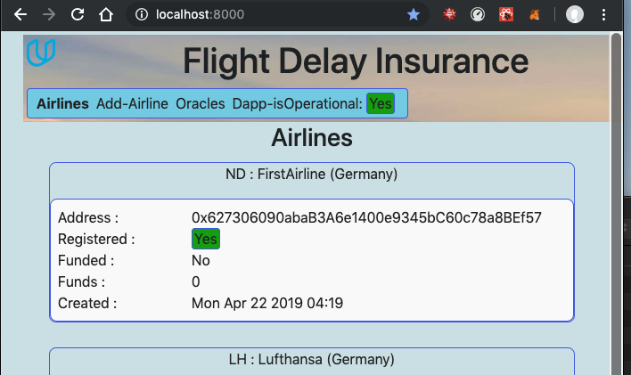
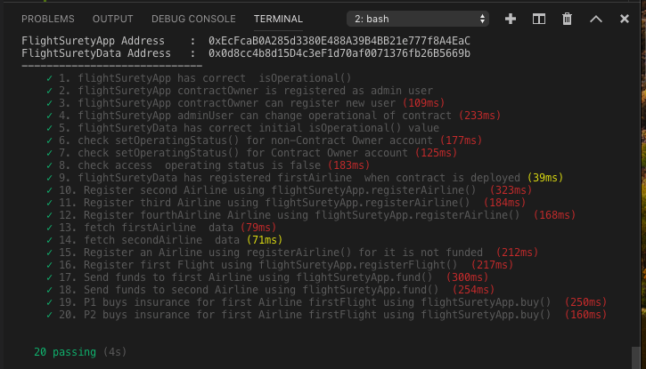
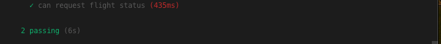
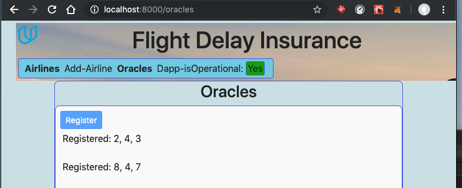
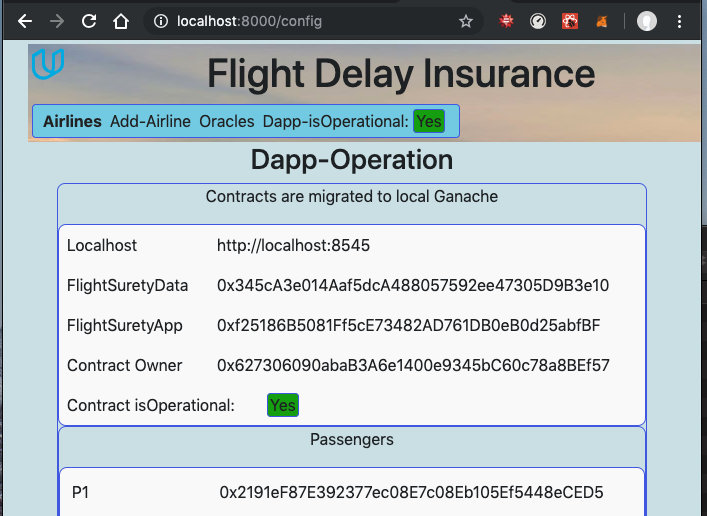
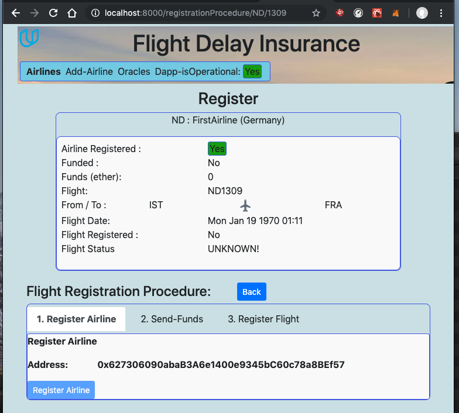
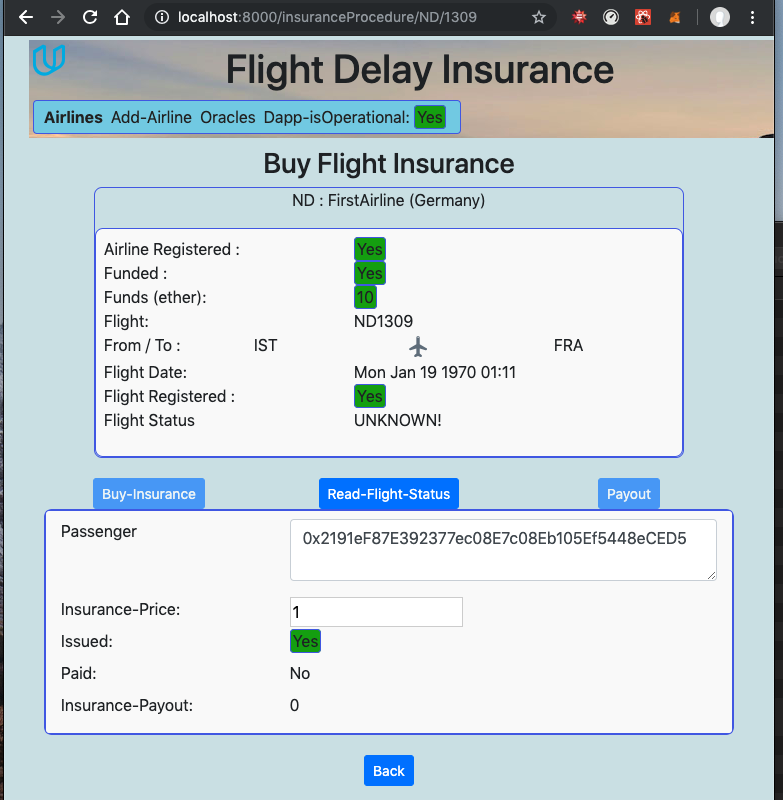

# Project Flight Surety
Flight Surety is a sample application for Udacity's Blockchain course. Flight delay insurance for passengers
**udbcd-p7-flight-surety**

This project is connected to the _Blockchain Developer Nanodegree Program_ course by **Udacity**.
Flight Surety is flight delay insurance for passengers. Managed as a collaboration between multiple airlines.
Passengers purchase insurance prior to flight.
If flight is delayed due to airline fault, passengers are paid 1.5x the amount they paid for the insurance.
Oracles provide flight status information.

The DApp User Interface when running should look like...


## Getting Started

These instructions will get you a copy of the project up and running on your local machine for development and testing purposes.

## Environment ###
This program requires **node.js**  and **npm** program envirenment 

## Prerequisites
Please make sure you've already installed 
  Tools and  used version
*   node               (v10.15.0)
*   npm                 (6.4.1)
*   Ganache CLI v6.2.5 (ganache-core: 2.3.3)
*   Truffle v5.0.12 (core: 5.0.12)
*   Solidity - ^0.4.24 (solc-js)
*   MetaMask extension for browser ( 6.1.0)
*   web3  (1.0.0-beta.46)

## Installing
A step by step series of examples that tell you have to get a development env running.
Attention!! This project is created using Truffle Boxes React. Therefore the procet directory structures are a little different for client and server.
It contains Smart Contract code in Solidity (using Truffle), tests (also using Truffle), dApp scaffolding (using react , react-redux ) and server app scaffolding.

#### Create a local working directory and then  clone github repository:
```
mkdir workspace
cd workspace
git clone https://github.com/nacikaly17/udbcd-p7-flight-surety.git
```
#### Install required node packages for server ( needed for oracles)
Change to folder ```server```  and install all requisite npm packages (as listed in ```package.json```):

```
cd udbcd-p7-flight-surety
cd server
npm install
```
#### Install required node packages for dapp client
Change to folder ```client```  and install all requisite npm packages (as listed in ```package.json```):

```
cd ../client
npm install
```
#### Open a  terminal window and Launch Ganache:
If you are using ganache-cli use this command to add 40 funded accounts:
```
ganache-cli -p 8545 -m "candy maple cake sugar pudding cream honey rich smooth crumble sweet treat" --gasLimit 300000000 --gasPrice 20000000000 -a 40

```

#### Open a separate terminal window and  compile smart contracts:
Change to project folder ```udbcd-p7-flight-surety``` 
```
truffle compile
```

This will create the smart contract artifacts in folder ```./client/src/contracts```.

#### Migrate smart contracts to the locally running blockchain, ganache-cli:
Change to project folder ```udbcd-p7-flight-surety``` 
```
truffle migrate --reset
```
This will :
  - deploy the smart contract artifacts to running Ganache 
  - create ```config.json``` file in folder ```./client/src/utils```.
   - create ```config.json``` file in folder ```./server/src/server```.
 
#### Test smart contracts:
Change to project folder ```udbcd-p7-flight-surety``` 
```
truffle test ./test/flightSurety.js 
```
All 20 tests should pass.

```
truffle test ./test/oracles.js  
```
All 2 tests should pass.

#### In a separate terminal window, launch oracles server:
Change to server folder ```udbcd-p7-flight-surety/server``` 
```
npm run server
```

#### In a separate terminal window, launch the DApp:
Change to client folder ```udbcd-p7-flight-surety/client``` 
```
npm run dapp
```
Your terminal should look something like this:


## Testing DApp with User Interface.
Now we can test our DApp with UI :
Open [http://localhost:8000](http://localhost:8000) to use DApp User Interface.
## 1. Register oracles.

## 2. Set Operation.

## 3. Register Airline, Flight.

## 4. Buy Insurance.


## Built With

* [Ethereum](https://www.ethereum.org/) - Ethereum is a decentralized platform that runs smart contracts
* [Truffle Framework](http://truffleframework.com/) - Truffle is the most popular development framework for Ethereum with a mission to make your life a whole lot easier.

## Acknowledgments
* Solidity
* Ganache-cli
* Truffle
* IPFS
* HTML
* JavaScript
* Node
* reactjs
* reactjs-redux

## Resources

* [How does Ethereum work anyway?](https://medium.com/@preethikasireddy/how-does-ethereum-work-anyway-22d1df506369)
* [BIP39 Mnemonic Generator](https://iancoleman.io/bip39/)
* [Truffle Framework](http://truffleframework.com/)
* [Ganache Local Blockchain](http://truffleframework.com/ganache/)
* [Remix Solidity IDE](https://remix.ethereum.org/)
* [Solidity Language Reference](http://solidity.readthedocs.io/en/v0.4.24/)
* [Ethereum Blockchain Explorer](https://etherscan.io/)
* [Web3Js Reference](https://github.com/ethereum/wiki/wiki/JavaScript-API)
* [ReactJs Reference](https://reactjs.org/)